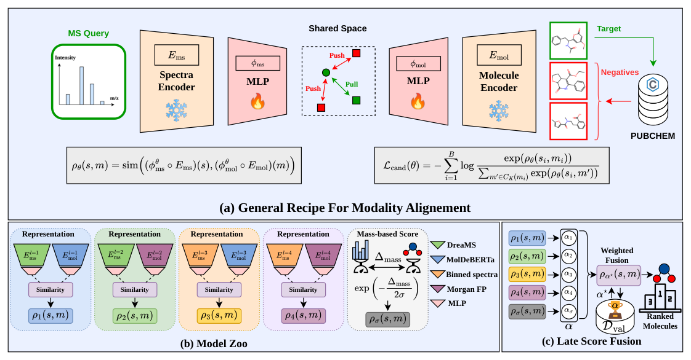
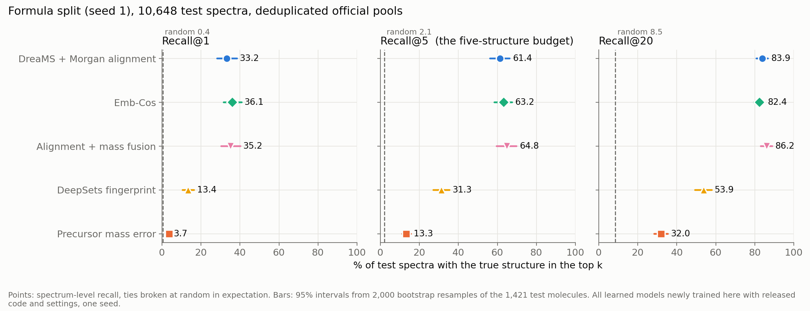
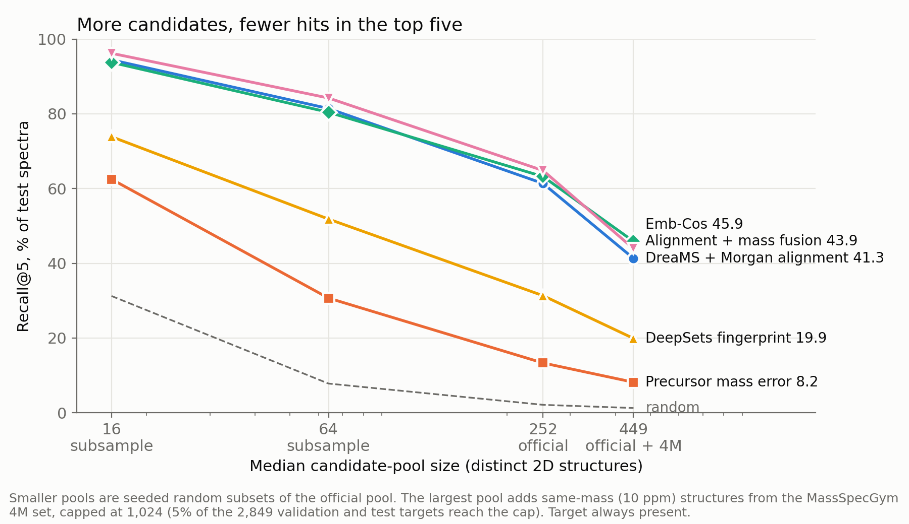
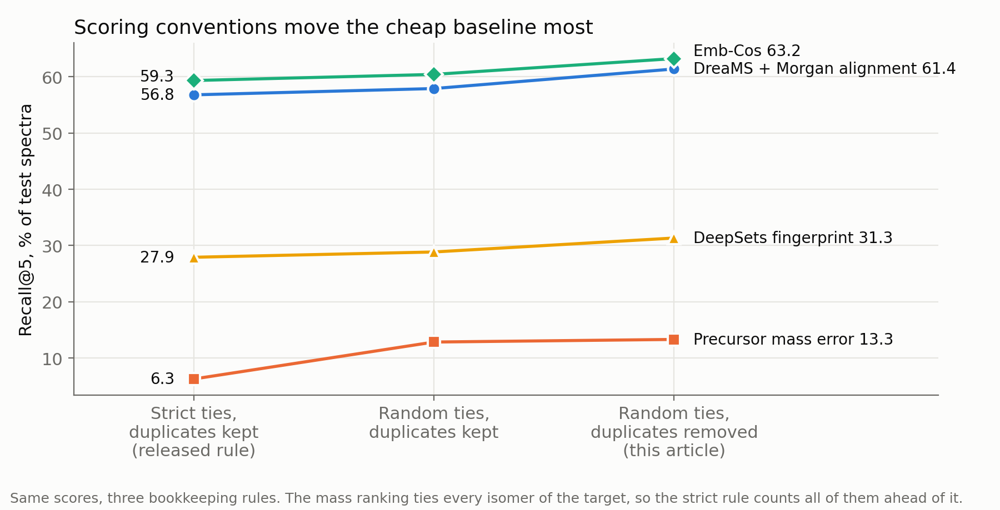
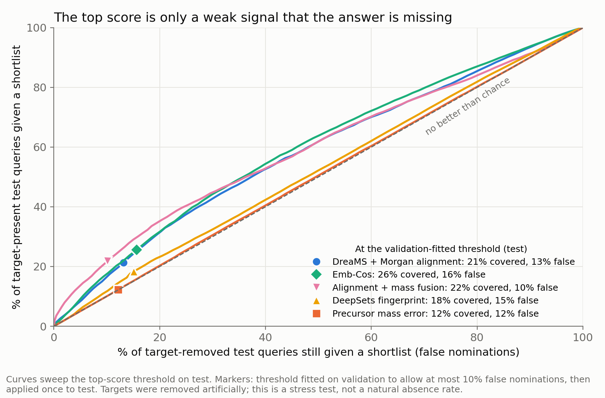
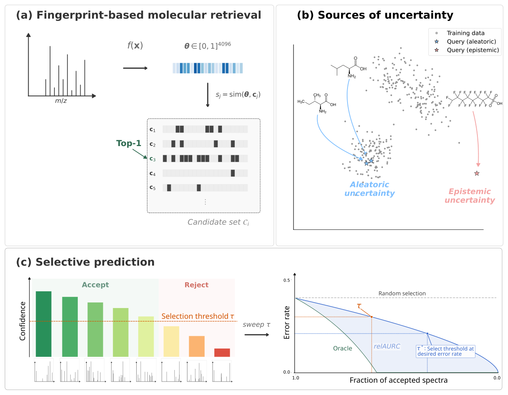
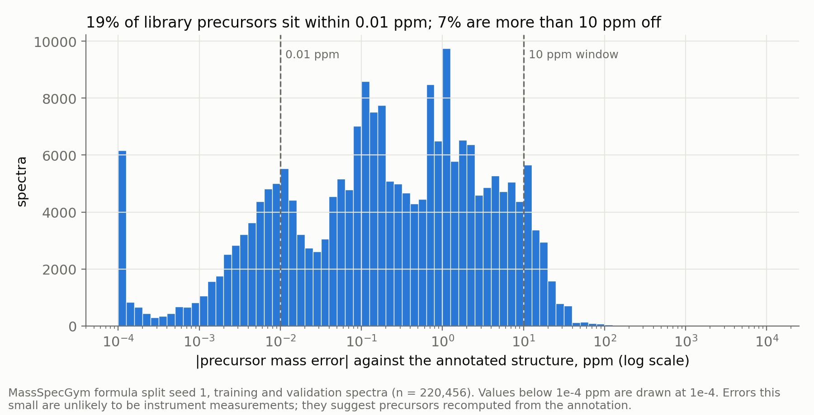
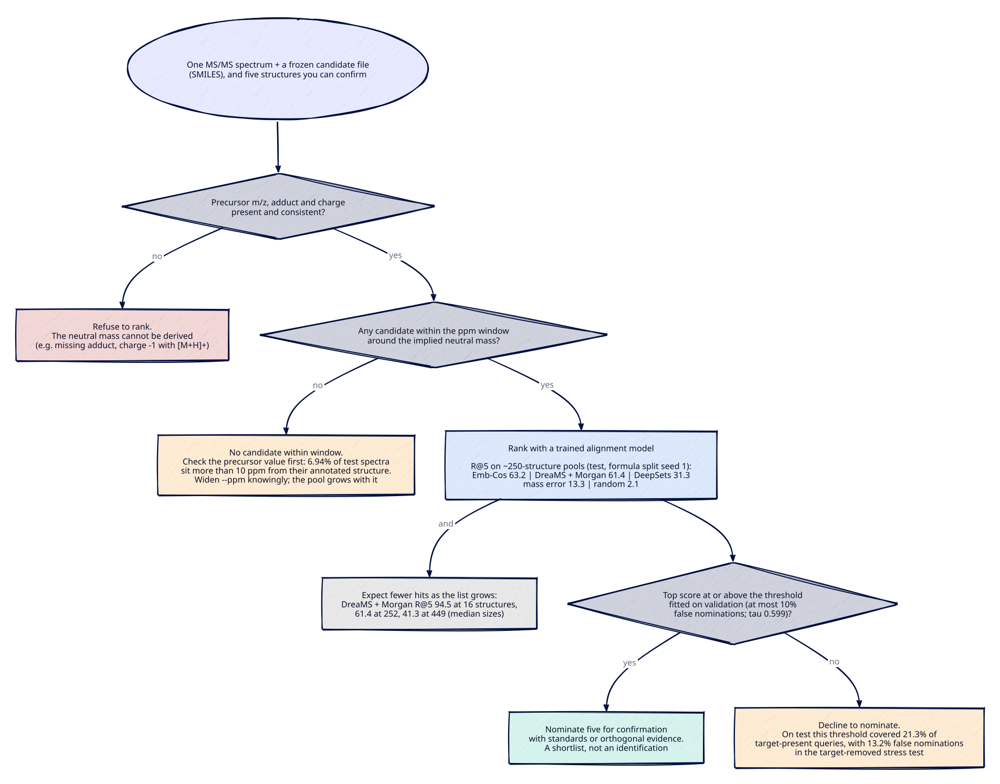

If you can confirm five candidate structures for an MS/MS spectrum, a learned alignment model is the clear first choice for picking those five on this benchmark. Two trained alignment models, Emb-Cos and the MSAlign DreaMS + Morgan pair, put the true structure in the top five for 63.2% and 61.4% of test spectra, on pools with a median of 252 mass-matched structures (within 10 ppm). The DeepSets fingerprint predictor reached 31.3%, ranking by precursor mass error 13.3%, and random ordering 2.1%. The two alignment models showed no detectable difference: use DreaMS + Morgan if you run the companion tool as shipped, and the cheaper Emb-Cos recipe if you train your own. These are new measurements on one population: MassSpecGym formula split seed 1 as processed by the MSAlign authors[^1][^2], 10,648 test spectra from 1,421 molecules, [M+H]+ and [M+Na]+ adducts only, identity judged on 2D structure, and one training seed per model.

Expect fewer hits as the candidate list grows: 41.3% (DreaMS + Morgan) and 45.9% (Emb-Cos) when pools grew to a median of 449 structures. Treat the top score as a weak signal that the answer is missing, and check the precursor value and the mass window before ranking anything.

Numbers carry one of five labels: **published**, **reproduction** (released code re-run and scored by the released rule), **new measurement** (under a protocol frozen before any test score existed), **post hoc** (descriptive, added afterwards) and **untested**. A shortlist is a set of structures to confirm, not an identification.

## The task is ranking a frozen, mass-matched list without the formula

An MS/MS spectrum records the fragments of one selected ion, whose mass-to-charge ratio is the precursor m/z. The adduct names the ion form: [M+H]+ is the molecule plus a proton, [M+Na]+ the molecule plus a sodium ion. The precursor m/z, adduct and charge give the neutral mass, and the structures whose exact masses fall within a tolerance of it, in parts per million (ppm), form the candidate pool.

In the MassSpecGym benchmark, each pool holds up to 256 structures within 10 ppm of the annotated structure's mass, drawn from three databases in priority order "until the maximum number of candidates |C| = 256 is reached"[^1]. The pools are centred on the annotated structure's mass, not on the measured precursor, so the true structure is in every pool by construction. A real search has to centre on the measured precursor.

Many decoys are isomers, with the same formula and therefore the same exact mass: in the validation pools, 32.6% of distinct decoys had exactly the target's monoisotopic mass. No mass rule can separate them; Kind and Fiehn showed that accurate mass cannot fix a unique formula even at 0.1 ppm[^3].

Identity is 2D: structures that differ only in stereochemistry, which the first block of an InChIKey leaves out, count as the same answer. This post compares RDKit canonical SMILES with stereochemistry removed. Recall@k is the share of test spectra whose true structure is among the first k ranked candidates; Recall@5 matches the confirmation budget, so it is the primary metric.

Methods given the target's true formula form a separate track, which MSAlign v2 reports in its own panel[^4]. Everything here is formula-free: each method sees the peaks, precursor m/z, adduct, charge and candidates, and nothing else.

| Method | Spectrum input | Structure input | Score |
|---|---|---|---|
| Random ordering | none | none | random order (expected value) |
| Precursor mass error | precursor m/z, adduct, charge | exact mass | smallest absolute ppm error first |
| DeepSets fingerprint predictor | peak list | Morgan fingerprint | cosine between predicted and candidate fingerprint |
| Emb-Cos | binned peaks | Morgan fingerprint | cosine in a learned shared space |
| DreaMS + Morgan (MSAlign code) | DreaMS embedding | Morgan fingerprint | cosine in a learned shared space |
| Alignment + mass fusion (exploratory) | DreaMS embedding and precursor | Morgan fingerprint and exact mass | weighted sum of z-scored DreaMS + Morgan and mass-error scores; mass weight 0.55 chosen on validation Recall@5 |

*Table 1. The formula-free methods run here. All learned models were newly trained with released code and settings, one seed (42) each.*

A Morgan fingerprint is a bit vector of the circular substructures around each atom[^5]. Contrastive alignment trains a spectrum encoder and a structure encoder so that a spectrum lands close to its true structure in a shared space and away from decoys; Emb-Cos is De Waele et al.'s name for this cosine formulation[^6]. DreaMS is a transformer "pre-trained in a self-supervised way on millions of unannotated tandem mass spectra"[^7]. Abstention, or declining to nominate, means returning no shortlist when the top score falls below a threshold fitted in advance.

## Published numbers set expectations but do not transfer directly

MSAlign v2, posted on 25 September 2026, reports formula-free results on the MassSpecGym formula split as means and standard deviations over three split seeds (Table 2)[^4].

| Method (MSAlign v2, published) | R@1 | R@5 | R@20 |
|---|---:|---:|---:|
| DeepSet (Fourier features, 50 epochs) | 4.7 ± 0.6 | 13.0 ± 1.3 | 27.5 ± 2.0 |
| JESTR | 13.9 ± 0.5 | 32.5 ± 0.8 | 57.0 ± 0.7 |
| Emb-Cos | 42.7 ± 3.0 | 65.2 ± 2.8 | 80.4 ± 1.6 |
| Binned + Fingerprint pair (Table 4) | 34.3 ± 1.3 | 56.2 ± 2.4 | 71.8 ± 1.3 |
| DreaMS + Fingerprint pair (Table 4) | 38.6 ± 2.8 | 60.4 ± 2.1 | 77.6 ± 0.8 |
| MSAlign, DreaMS + MolDeBERTa, standalone | 47.5 ± 3.4 | 71.3 ± 2.6 | 87.0 ± 1.1 |
| MSAlign fused (7 scores, 3 of them mass scores) | 58.2 ± 3.4 | 80.7 ± 3.0 | 92.8 ± 1.1 |

*Table 2. PUBLISHED. MSAlign v2 Tables 3 and 4, MassSpecGym formula split, Recall@k in %, mean ± SD over three split seeds, official pools of up to 256 candidates including repeated structures. The paper says only that a fixed tie-breaking rule was used; the released code counts ties against the target[^8]. The standalone (47.5) and fused (58.2) MSAlign rows are different models. Formula-known methods are omitted because they receive the true formula.*

Three things limit what this table can tell a reader.

First, the paper's two versions disagree. MSAlign v1 (19 May 2026) printed DeepSets at 22.2% Recall@1 and the DreaMS + fingerprint pair at 48.5%; v2 prints 4.7% and 38.6% for the same split[^9][^4]. v1's headline 53.8% used ChemBERTa rather than MolDeBERTa, so it is a different model from v2's 47.5%, not an earlier value for the same one.

Second, the strongest published rows were not run here. Both v2 MSAlign models, standalone and fused, use MolDeBERTa and have no released checkpoints (they "will be released upon publication"[^4]); MolDeBERTa is licensed CC BY-NC-ND 4.0[^10], and the candidate embedding cache would take about 20 GB. JESTR, and the formula-informed FLARE and MVP, need a Linux CUDA stack.

Third, MassSpecGym numbers carry known hazards. An audit by MassSpecGym's authors and others found "evaluation issues in at least 17 of 26 papers reporting MassSpecGym benchmark results in the first year of its adoption"[^11]. The same audit showed that filtering a mass-based pool to the true formula alone lifts a random ranker's Hit@1 (Recall@1) from 0.43% to 12.98%[^11]. A published Recall@k describes one pool construction, one split and one tie rule.



*Figure 1. PUBLISHED. The MSAlign recipe: frozen encoders joined by small trained networks, a "model zoo" of representation pairs plus a Gaussian mass scorer, and late fusion calibrated on validation data. Of the representation pairs in panel (b), only DreaMS + Morgan fingerprint was retrained here; the MolDeBERTa pairs and the fused model are published numbers only. Figure 1 from Krzakala P, Melo G, Lançon C, Laclau C, Flamary R, Thévenot E, d'Alché-Buc F. "MSAlign: Aligning Molecule and Mass Spectra representations for Metabolite Identification." arXiv:2605.19752v2 (2026), https://arxiv.org/abs/2605.19752v2. CC BY 4.0 (https://creativecommons.org/licenses/by/4.0/). Cropped; caption removed.*

## The harness reproduces the released evaluation; at one seed only DreaMS + Morgan lands mostly inside the paper's band

Before any new measurement, each model was retrained with the released code and settings at split seed 1, one of the paper's three, and scored by the released rule: strict ties, official lists with duplicates counted. The scoring harness reproduced each released evaluation exactly on validation and test.

| Model (selected checkpoint) | R@1 | R@5 | R@20 | v2 mean ± 2 SD (R@1 / R@5 / R@20) | Verdict |
|---|---:|---:|---:|---|---|
| DreaMS + Morgan pair, MSAlign code (step 3,296 of 30,000) | 32.6 | 56.8 | 76.7 | 33.0-44.2 / 56.2-64.6 / 76.0-79.2 | R@1 just below; R@5, R@20 inside |
| Emb-Cos, model_zoo (epoch 3) | 35.4 | 59.3 | 76.8 | 36.7-48.7 / 59.6-70.8 / 77.2-83.6 | all three below |
| DeepSets + Fourier, model_zoo (epoch 3) | 13.1 | 27.9 | 46.9 | 3.5-5.9 / 10.4-15.6 / 23.5-31.5 | all three far above |

*Table 3. REPRODUCTION. MassSpecGym formula split seed 1, test fold, strict ties, official lists with duplicates kept, Recall@k in %. One training seed (42) per model.*

DreaMS + Morgan sits just below the band on Recall@1 and inside it on Recall@5 and Recall@20. It peaked early (validation Recall@1 0.376 after two epochs), and the released rule keeps that checkpoint. Emb-Cos fell below the band on all three cut-offs. DeepSets landed far above v2 on all three cut-offs; at Recall@5 and Recall@20 it sits closer to v1's printed 36.1 and 50.9, and at Recall@1 (13.1) roughly midway between v2's 4.7 and v1's 22.2. With one split seed and one training run, a miss shows where this run landed. It does not show that the paper is wrong.

## Under a frozen protocol, both alignment models lead and were not separated at this seed

The protocol, frozen before any test score existed, changes two conventions from the released evaluation. Repeated 2D structures are removed: once stereochemistry is stripped, 85.4% of the 28,936 official lists contain at least one repeated structure (mean 6.9 repeats, maximum 121), and removal leaves a median of 252 distinct structures. Ties are scored at their expected value under random tie-breaking, so a target tied with three decoys counts as the average over the four possible orders.

| Method | R@1 [95% CI] | R@5 [95% CI] | R@20 [95% CI] |
|---|---:|---:|---:|
| Random ordering (expectation) | 0.4 | 2.1 | 8.5 |
| Precursor mass error | 3.7 [2.9, 4.5] | 13.3 [11.2, 15.6] | 32.0 [28.4, 35.5] |
| DeepSets fingerprint predictor | 13.4 [10.6, 16.5] | 31.3 [27.2, 35.5] | 53.9 [49.4, 57.9] |
| Emb-Cos | 36.1 [31.6, 40.9] | 63.2 [58.4, 67.5] | 82.4 [79.5, 85.1] |
| DreaMS + Morgan alignment | 33.2 [28.3, 38.4] | 61.4 [56.2, 66.3] | 83.9 [80.8, 86.8] |
| Alignment + mass fusion (exploratory) | 35.2 [30.4, 40.2] | 64.8 [59.6, 69.9] | 86.2 [83.0, 89.0] |

*Table 4. NEW MEASUREMENT. MassSpecGym formula split seed 1, 10,648 test spectra from 1,421 molecules, deduplicated official pools (median 252 structures), random-tie expectation, Recall@k in %. Every method scored every spectrum; there were no failures.*



*Figure 2. NEW MEASUREMENT. Recall@1, @5 and @20 on MassSpecGym formula split seed 1 (10,648 test spectra, deduplicated official pools), ties broken at random in expectation. Bars are 95% intervals from 2,000 bootstrap resamples of the 1,421 test molecules; dashed lines are the random expectation. All learned models were newly trained here with released code and settings, one seed each. Higher is better.*

In counts, either alignment model would put the true structure among your five confirmations for about six spectra in ten; mass error would do so for fewer than one in seven.

| Pre-declared contrast (Recall@5) | Difference, points [95% CI] |
|---|---:|
| C1: DreaMS + Morgan minus mass error | +48.0 [+42.2, +53.6] |
| C2: DreaMS + Morgan minus Emb-Cos | −1.85 [−5.19, +1.35] |
| C3: DeepSets minus mass error | +18.0 [+13.4, +22.5] |

*Table 5. NEW MEASUREMENT. Paired differences on the same bootstrap resamples of molecules, MassSpecGym formula split seed 1 test fold, deduplicated official pools.*

C1 and C3, declared before scoring, compare learned models with mass error: DreaMS + Morgan beat it by 48.0 points of Recall@5 and DeepSets by 18.0, both with intervals well clear of zero. No contrast was declared between alignment and fingerprint prediction; the alignment models' intervals ([56.2, 66.3] and [58.4, 67.5]) do not overlap the DeepSets interval [27.2, 35.5].

C2, at −1.85 points [−5.19, +1.35], includes zero: no detectable difference between these two trained models. That is not equivalence, and a modest gap in either direction is not ruled out. Nor is C2 a test of spectral pretraining. The models differ in spectrum input (DreaMS embedding against binned peaks), architecture, loss settings, training budget and selected epoch, and each was trained once. The paper's controlled pair, DreaMS + fingerprint at 38.6% against binned + fingerprint at 34.3% Recall@1 (v2 Table 4), is published and was not reproduced here[^4].

Which one to use depends on what you will run. On one Apple M4 machine with 16 GB of memory, Emb-Cos trained in 3.0 hours (16,000 steps) and DreaMS + Morgan in 7.75 hours (30,000 steps, with the selected checkpoint at step 3,296), so the difference in training time partly reflects different step budgets. The companion tool ships only a trained DreaMS + Morgan bundle, plus mass-only ranking. If you will use the companion as it is, use DreaMS + Morgan. If you will train your own model, the cheaper Emb-Cos recipe showed no detectable difference at this seed, but you will need to score with it yourself and fit its own decline threshold.

The fusion with mass error reached 64.8% Recall@5, but it is exploratory, leans on recomputed precursor values (see below) and is not the recommendation.

## More candidates mean fewer hits for every method

The pool-size stress test kept the target in every pool. The 16- and 64-structure pools are seeded random subsets of the official pool. The largest pools add structures within 10 ppm of the target's mass from the MassSpecGym 4M set, capped at 1,024 (test median 449, IQR 296-691; 5.1% of the 2,849 validation and test targets reach the cap).



*Figure 3. NEW MEASUREMENT (stress test). Recall@5 against median pool size on MassSpecGym formula split seed 1 (10,648 test spectra), random-tie expectation, target always present. The 16 and 64 pools are seeded subsets of the official pool; the 449 pool adds same-mass structures from the MassSpecGym 4M set, a different database snapshot. Pool size is on a log scale. Higher is better.*

DreaMS + Morgan Recall@5 fell from 94.5% at 16 structures to 81.4% at 64, 61.4% at 252 and 41.3% at 449, and its Recall@1 from 69.2% to 19.1%. Random ordering fell from 31.2% to 1.3%.

The order of method families held at every size: alignment models (with or without fusion), then DeepSets, mass error and random ordering. Within the top family it did not. DreaMS + Morgan led Emb-Cos at 16 structures (94.5% against 93.8%) and trailed at 449 (41.3% against 45.9%), where fusion (43.9%) also fell below Emb-Cos. The expanded-pool paired difference, −4.56 points [−7.95, −1.19], was not pre-declared and uses decoys drawn differently from the official ones, so I read it as a reason to test both models at your own list size, not as a ranking.

Small pools also inflate weak methods' scores: Giné et al. found that at 0.1 ppm "the random-model baseline was substantially higher due to the smaller candidate pools"[^12]. Quote an expected Recall@5 with its list size, and if your list is much longer than 252 structures, expect less than the official-pool numbers.

## Scoring conventions move the cheap baseline most

Figure 4 applies three counting conventions for ties and duplicates to identical scores.



*Figure 4. NEW MEASUREMENT. Recall@5 on MassSpecGym formula split seed 1 test spectra under three bookkeeping rules applied to the same scores: the released strict rule with duplicates kept, random-tie expectation with duplicates kept, and random-tie expectation with duplicates removed (this post's primary rule).*

Mass error doubled, from 6.3% Recall@5 under the strict rule to 13.3% under the primary rule, and its Recall@1 rose from 0.8% to 3.7%. The learned models moved by a few points: DreaMS + Morgan from 56.8% to 61.4%. Mass error is hit hardest because every isomer of the target ties with it, and the strict rule counts all of them ahead of the target. MSAlign v2's single Gaussian mass scorers reach only 0.6-0.8% Recall@1 on their own[^4], which is consistent with strict counting on isomer-rich pools; that link is an inference.

Conventions differ across the literature. MSAlign's released code is strict[^8], and Gupta et al. broke ties "by random permutation"[^13]. Guo et al., writing about recommender systems, note that such a gap "follows mechanically from the tie block; it is not evidence that the score identified the relevant item"[^14]. State the rule next to any number you report.

## The top score is only a weak signal that the answer is missing

Benchmark pools always contain the answer; a real search may not. Each deduplicated test pool was therefore scored twice, intact and with the target removed. This artificial removal is a controlled stress test, not a measured rate of real absence.

Confidence was the top-1 score. Two threshold rules were fitted on validation and applied once to test: at most 10% false nominations on validation, and keep 90% of target-present validation queries covered. "Covered" is the share of target-present test queries given a shortlist; "false" is the share of target-removed test queries still given one.

| Method | Threshold rule (fitted on validation) | Covered [95% CI] | R@5 among covered | False nominations [95% CI] |
|---|---|---:|---:|---:|
| DreaMS + Morgan | at most 10% false | 21.3% [16.2, 26.6] | 68.4% | 13.2% [9.0, 18.0] |
| DreaMS + Morgan | keep 90% covered | 90.8% | 64.3% | 86.6% |
| Emb-Cos | at most 10% false | 25.5% [22.0, 29.1] | 83.7% | 15.7% [12.5, 19.1] |
| Emb-Cos | keep 90% covered | 90.8% | 66.6% | 85.6% |
| DeepSets | at most 10% false | 18.4% | 52.8% | 15.1% |
| Fusion (exploratory) | at most 10% false | 21.8% | 86.8% | 10.2% |
| Mass error | at most 10% false | 12.2% | 22.1% | 12.1% |

*Table 6. NEW MEASUREMENT (stress test, artificial target removal). MassSpecGym formula split seed 1 test fold, deduplicated official pools. Confidence is the top-1 score.*



*Figure 5. NEW MEASUREMENT (stress test, artificial target removal). Each curve sweeps the top-score threshold on MassSpecGym formula split seed 1 test spectra; markers show the threshold fitted on validation to allow at most 10% false nominations. The diagonal is no better than chance. Legend values are rounded to whole percentages; Table 6 gives one decimal.*

Under the at-most-10%-false rule, DreaMS + Morgan nominated for 21.3% of target-present test queries (68.4% of those shortlists held the answer) and still nominated for 13.2% of target-removed ones. The test false-nomination rates of the three single learned models (13.2-15.7%) all exceeded the 10% validation target. Using the margin between the top two scores instead kept false nominations under target but covered fewer queries: 13.8% covered with 9.6% false for DreaMS + Morgan, and 18.4% with 9.8% for Emb-Cos.

Mass error has no signal here. Its coverage (12.2%) equals its false-nomination rate (12.1%), because removing the target leaves its isomers with the same top score.

For a reader, the consequence is a choice of failure mode. The 10% threshold declines about four in five target-present queries; the 90%-coverage threshold nominates for 86.6% of target-removed ones. In neither case is a cosine score a probability that the top structure is right.



*Figure 6. PUBLISHED. Selective prediction as framed by Jürgens et al.: retrieval with a top-1 pick, sources of uncertainty, and accepting or rejecting by a confidence threshold traced as a risk-coverage curve. Their default evaluation uses formula-filtered pools that always contain the target, unlike the target-removal test above[^15]. Fig. 1 from Jürgens M, De Waele G, Rakhshaninejad M, Waegeman W. "When should we trust the annotation? Selective prediction for molecular structure retrieval from mass spectra." arXiv:2603.10950v2 (2026). CC BY 4.0. Cropped; caption removed.*

Declining is not a new idea. COSMIC found the margin between hit and runner-up, and the number of candidates, to be "highly important features" for confidence[^16], and MS2Query filtered unreliable matches with a score threshold[^17]. Jürgens et al. concluded that "when the majority of predictions are incorrect, any procedure with valid risk guarantees must abstain from making predictions for most instances", and named target-absent pools as "an important open-world setting"[^15]. Gupta et al. and Giné et al. varied candidate sets in other ways[^13][^12]. The specific combination here (controlled target removal with validation-fitted thresholds and false-nomination rates for formula-free alignment models, nested pool sizes from one mass window, and tie-rule effects) was not found in a dated literature search on 4 October 2026.

## Check the precursor value before trusting any ranking



*Figure 7. NEW MEASUREMENT (data audit). Absolute precursor mass error against the annotated structure for MassSpecGym formula split seed 1 training and validation spectra (n = 220,456): 19.1% within 0.01 ppm, 7.07% more than 10 ppm away, median 0.211 ppm. The chart title rounds these to 19% and 7%. Values below 1e-4 ppm are drawn at 1e-4.*

In the training fold (n = 210,825), 19.0% of spectra sit within 0.01 ppm of the annotated structure's theoretical mass. Errors below 0.01 ppm are far tighter than the high (under 5 ppm) or very high (under 1 ppm) mass accuracy that Kind and Fiehn describe[^3]. They suggest values recomputed from the annotation, as library curation can do: Spectraverse documents that "parent masses were recalculated from SMILES"[^18].

At the other end, 6.94% of test spectra lie more than 10 ppm from the annotated structure, and 16.1% more than 5 ppm (exploratory, added by protocol amendment A1). These spectra keep their answer only because the benchmark pools are centred on the annotated structure's mass. A real search centred on the measured precursor would lose it before any ranking, so for these spectra the benchmark overstates what a real search would recover.

A post hoc split of the test fold by precursor error (Table 7) shows where the mass baseline gets its strength: 31.6% Recall@5 on recomputed-looking precursors and 9.2% on the 0.01-10 ppm group, which looks more like measured data. The 21% of test spectra in the first group supply about half of all its hits.

| Stratum (post hoc) | Spectra / molecules | Mass error | DreaMS + Morgan | Emb-Cos | Fusion |
|---|---:|---:|---:|---:|---:|
| Within 0.01 ppm (recomputed-looking values) | 2,264 / 526 | 31.6 [27.5, 35.8] | 54.3 | 59.0 | 62.7 |
| 0.01-10 ppm | 7,645 / 1,002 | 9.2 [7.2, 11.7] | 61.8 | 63.7 | 64.2 |
| Beyond 10 ppm | 739 / 105 | 0.1 | 78.5 | 71.2 | 77.4 |

*Table 7. POST HOC, descriptive. Recall@5 in % by precursor error stratum, MassSpecGym formula split seed 1 test fold, deduplicated official pools, random-tie expectation.*

Fusion added 8.4 points over DreaMS + Morgan on recomputed precursors and 2.4 points on the 0.01-10 ppm group. Much of its benefit therefore comes from precursor values that real measurements would not provide, which is why fusion stays exploratory here. Mass is still worth using as a filter, because it defines the pool. It should not be the ranker.

## Running the shortlist on your own spectra

For each spectrum, the companion tool follows the path in Figure 8:



*Figure 8. The decision path the companion tool follows for one spectrum, with the benchmark numbers that bear on each step (MassSpecGym formula split seed 1 test fold; NEW MEASUREMENT and stress-test figures from Tables 4 and 6, the pool-size stress test and the precursor audit). Mass-only runs skip the threshold step and never decline on score.*

Spectra go in an MGF file with `PEPMASS`, `CHARGE` and `ADDUCT` in every block; candidates go in a CSV with `id` and `smiles` columns, frozen before you look at any scores. These are the commands from the companion README, and both were executed for this article:

```bash
uv sync            # uses uv.lock: torch 2.2.1, rdkit 2023.9.6, numpy 1.25.0, pandas 2.2.1

# Mass-error ranking only (no model files needed)
uv run msms-shortlist --spectra examples/mh.mgf --candidates examples/mh-candidates.csv \
    --out out/mh-mass.csv

# Trained DreaMS + Morgan alignment model
uv run msms-shortlist --spectra examples/mh.mgf --candidates examples/mh-candidates.csv \
    --model models/dreams_morgan_formula_seed1_fp16.pt \
    --dreams weights/DreaMS_embedding_model_torchscript.pt \
    --thresholds models/thresholds.json --out out/mh-model.csv
```

Without `--model`, candidates are ranked by mass error alone, and that run never declines on score. With the model, the tool declines when the top score is below the threshold in `models/thresholds.json`: 0.599, the lowest value that nominated at most 10% of target-removed validation queries.

The executed notebook ran the tool on two MassSpecGym test spectra chosen by a fixed rule before their scores were viewed, the first [M+H]+ and the first [M+Na]+, and ran the [M+H]+ spectrum again with its true structure removed from the candidate file. Each block is verbatim output from the run named above it; lines without a query identifier were printed by the notebook from the run's provenance file or ranked CSV.

Mass-only run, MassSpecGymID0226249 ([M+H]+, Orbitrap, 254 candidates):

```text
MassSpecGymID0226249: nominate shortlist
tie at shortlist boundary: True | candidates sharing the 5th score: 30
```

Model run, same spectrum:

```text
MassSpecGymID0226249: decline: top score below validation threshold
decision: decline: top score below validation threshold | top score: 0.0194 | threshold: 0.5994
rank of the annotated structure: 1
```

Model run, true structure removed:

```text
MassSpecGymID0226249: decline: top score below validation threshold
decision with the true structure removed: decline: top score below validation threshold | top score: -0.0245
```

[M+Na]+ model runs, MassSpecGymID0395778 (QTOF), `--ppm` 10, 50 and 200:

```text
MassSpecGymID0395778: no candidate within window (no structure within 10.0 ppm)
10 ppm: no candidate within window | candidates in window: 0
MassSpecGymID0395778: no candidate within window (no structure within 50.0 ppm)
50 ppm: no candidate within window | candidates in window: 0
MassSpecGymID0395778: decline: top score below validation threshold
200 ppm: decline: top score below validation threshold | candidates in window: 227
```

Invalid-metadata run (mass-only):

```text
no_adduct_example: refused (missing ADDUCT; the neutral mass cannot be derived)
wrong_charge_example: refused (charge -1 is inconsistent with adduct [M+H]+)
```

In the mass-only run the annotated structure is one of 30 candidates tied at the same mass, so the five nominated are an arbitrary cut. The model ranks it first yet declines, because 0.019 is below 0.599; with the structure removed, it declines too.

The [M+Na]+ spectrum fails before ranking: its recorded precursor, 826.4, is 117 ppm below the ion implied by the annotated structure, so no candidate lies within 10 or 50 ppm. Only the 200 ppm window readmits 227 of the file's 229 candidates, and the model then declines.

From a clean archive, `uv sync` took 1.5 s with a warm cache, the first CLI run 35 s including the package build, and a model run 5.3 s. The DreaMS weights reproduced the released embeddings (minimum cosine 0.99999988 over 64 spectra), and the exported model matched the benchmark harness on the demo spectrum to within 2.2e-4, with the same rank.

Downloads:

- [Companion code](../downloads/msms-shortlist-companion-code.tar.gz) (0.18 MB): the CLI and the benchmark scripts.
- DreaMS + Morgan model and threshold (45 MB), split for the site's 25 MiB file limit: [part 1](../downloads/msms-shortlist-dreams-morgan-model.tar.gz.part01), [part 2](../downloads/msms-shortlist-dreams-morgan-model.tar.gz.part02), [part 3](../downloads/msms-shortlist-dreams-morgan-model.tar.gz.part03), [reassemble-model.sh](../downloads/reassemble-model.sh) and [checksums](../downloads/msms-shortlist-dreams-morgan-model.parts.sha256). Save all five files in one folder and run `sh reassemble-model.sh`: it checks each part, joins them in order, verifies SHA-256 `646bbe4fbb14bda60e3544d4a963c9319b6564663c9b0752cd5e92b879eeffc9` and extracts the model (manual steps in the companion README).
- [Results, predictions and run receipts](../downloads/msms-shortlist-results.tar.gz) (7 MB).
- The DreaMS TorchScript weights (468 MB, MIT licence[^19]) are not bundled. Download them from Hugging Face `roman-bushuiev/DreaMS` at revision `c81a62766b10`.

## What to do in each situation

**Before ranking, check the precursor.** Compute the ppm error between the recorded precursor and your best-supported candidate masses (`ppm_error` in the output), and look at how many decimals the precursor carries. A value recorded to one decimal place, like the 826.4 above, is too coarse for a 10 ppm window at that mass. Recheck the raw file, adduct and charge first.

**If no candidate lies within the window,** recheck the precursor rather than widening the window. Widen `--ppm` only knowingly. In a frozen file a wider window only readmits that file's candidates. Against a real database it admits far more structures, recall falls as the pool grows (Figure 3), and the shipped threshold was fitted on pools of about 250 mass-matched candidates. Report the window, which the provenance file records, beside any shortlist.

**After a decline,** the ranked CSV (with a decision column and tie flags) is still written, so a lab that prefers to inspect every list can ignore the decision field. Treat a decline as triage, not as evidence of absence, since most target-present queries are declined too (Table 6). If you have labelled spectra from your own instrument and candidate source, refit the threshold on them: a conformal study found coverage falling below the nominal level when calibration and test data came from different molecular clusters[^20].

**With mass-only ranking,** expect a shortlist every time. When the tool reports a tie at the shortlist boundary, as with the 30 tied candidates above, check the `tied_with_previous` column and rank with the alignment model rather than confirm an arbitrary five.

## What this comparison does not show

- **One split seed, one training seed.** The intervals reflect which molecules were sampled, not variation between splits or training runs.
- **Untested methods.** MSAlign v2 standalone and fused (both MolDeBERTa), JESTR, FLARE, MVP and reference-spectrum library search.
- **Untested data.** No other split seeds, MCES-split training, Spectraverse, NPLIB1, instrument-held-out evaluation, real target absence, negative-mode spectra or adducts beyond [M+H]+ and [M+Na]+. The post hoc instrument strata (DreaMS + Morgan Recall@5 57.2% [51.3, 63.1] on Orbitrap, 71.2% [64.7, 76.8] on QTOF) are confounded by which molecules each instrument measured.
- **Possible encoder overlap.** The DreaMS checkpoint loaded by the MSAlign code was fine-tuned on a MoNA subset (about 25,000 spectra, 5,500 InChI connectivity blocks)[^7], and MassSpecGym draws spectra partly from MoNA[^1]. Overlap with the test molecules was not checked: this is an unmeasured possibility, not a finding.
- **Near-duplicate records.** 34.7% of test rows match more than one MassSpecGym record with the same structure, adduct, precursor and ten strongest peaks, so spectra are not independent; that is why the intervals resample molecules.
- **Shortcut controls.** The alignment models were not tested against generated decoys that resemble library compounds, of the kind Gupta et al. use[^13], nor by "masking all input MS/MS spectra with a constant value and confirming that performance degrades accordingly"[^11].
- **No identification.** The MSI minimum for a level 1 identification of a known (non-novel) metabolite is "a minimum of two independent and orthogonal data relative to an authentic compound analyzed under identical experimental conditions"[^21]. The confidence scale of Schymanski et al.[^22] invites researchers to define sublevels "on a per-study basis where evidence supporting different proposed structures is clearly presented"[^23].

## What would change this recommendation

Three results would change this advice. The first is further seeds that separate Emb-Cos from DreaMS + Morgan. The second is released MolDeBERTa checkpoints showing whether the published standalone MSAlign's 71.3% Recall@5 (v2, three-seed mean) holds under this protocol. The third is a collapse towards chance on generated decoys that resemble library compounds, or under spectrum masking, which would mean the alignment models lean on structure shortcuts. Until then, check the precursor first: compute its ppm error against your candidate masses, and recheck the precursor and adduct if it falls outside the window. Then rank with an alignment model, quote your list size, treat a low top score as a reason to decline, and confirm every nominee against a standard.

## References

[^1]: Bushuiev R, Bushuiev A, de Jonge NF, Young A, Kretschmer F, et al., Pluskal T. "MassSpecGym: A benchmark for the discovery and identification of molecules." *Advances in Neural Information Processing Systems* 37 (NeurIPS 2024, Datasets and Benchmarks), 2024. arXiv:2410.23326v3, 14 February 2025. https://arxiv.org/abs/2410.23326
[^2]: Krzakala P. "MSAlign Datasets, splits and candidate maps." Zenodo, publication date 18 September 2026. CC BY 4.0. https://doi.org/10.5281/zenodo.22830464
[^3]: Kind T, Fiehn O. "Metabolomic database annotations via query of elemental compositions: Mass accuracy is insufficient even at less than 1 ppm." *BMC Bioinformatics* 7:234, 2006. https://doi.org/10.1186/1471-2105-7-234
[^4]: Krzakala P, Melo G, Lançon C, Laclau C, Flamary R, Thévenot E, d'Alché-Buc F. "MSAlign: Aligning Molecule and Mass Spectra representations for Metabolite Identification." arXiv:2605.19752v2, 25 September 2026 (labelled NeurIPS 2026). https://arxiv.org/abs/2605.19752v2
[^5]: Rogers D, Hahn M. "Extended-connectivity fingerprints." *Journal of Chemical Information and Modeling* 50(5):742-754, 2010. https://doi.org/10.1021/ci100050t
[^6]: De Waele G, Wydmuch M, Dembczyński K, Kotłowski W, Waegeman W. "Small molecule retrieval from tandem mass spectrometry: what are we optimizing for?" arXiv:2602.16507v1, 18 February 2026. https://arxiv.org/abs/2602.16507
[^7]: Bushuiev R, Bushuiev A, Samusevich R, Brungs C, Sivic J, Pluskal T. "Self-supervised learning of molecular representations from millions of tandem mass spectra using DreaMS." *Nature Biotechnology* 44(4):630-640, 2026 (online 23 May 2025). https://doi.org/10.1038/s41587-025-02663-3
[^8]: Krzakala P, et al. MSAlign-NeurIPS2026 README, GitHub, commit c2ef425b6874. https://github.com/KrzakalaPaul/MSAlign-NeurIPS2026/blob/c2ef425b68749052a17b9cdd5f5f11709322654e/README.md
[^9]: Krzakala P, Melo G, Lançon C, Laclau C, Flamary R, Thévenot E, d'Alché-Buc F. "MSAlign: Aligning Molecule and Mass Spectra Foundation Models for Metabolite Identification." arXiv:2605.19752v1, 19 May 2026 (superseded by v2). https://arxiv.org/abs/2605.19752v1
[^10]: SaeedLab. MolDeBERTa-base-123M-mtr model card, Hugging Face, revision 7d06a5f3 (licence cc-by-nc-nd-4.0). https://huggingface.co/SaeedLab/MolDeBERTa-base-123M-mtr
[^11]: Liu H, Bushuiev R, Lightheart I, Manjrekar M, Bushuiev A, Lederbauer M, Jozefov F, Wang Y, Hassoun S, Sivic J, Taylor J, Wang R, Healey D, Pluskal T, Coley CW. "MassSpecGym in the Wild: Uncovering and Correcting Evaluation Pitfalls in AI-Driven Molecule Discovery." arXiv:2606.19624v1, 17 June 2026 (preprint). https://arxiv.org/abs/2606.19624
[^12]: Giné R, Pérez-López I, Badia JM, Capellades J, Yanes O. "Benchmarking MS/MS Featurization Strategies for Machine Learning-Driven Metabolite Structure Annotation." *Journal of the American Society for Mass Spectrometry* 37(7):1550-1561, 2026. https://doi.org/10.1021/jasms.5c00428
[^13]: Gupta V, Xu C, Herbst E, Wang F, Wishart DS, Skinnider MA. "Confronting spurious evaluations of computational methods in small molecule mass spectrometry." bioRxiv 10.64898/2026.05.03.722532, v2, 14 July 2026 (preprint, not peer reviewed). https://www.biorxiv.org/content/10.64898/2026.05.03.722532v2
[^14]: Guo C, Chen H, Zhu Y, Li Y. "Tie Handling Is Part of the Evaluation Protocol: An Order-Invariance Audit for Tie-Heavy Recommender Scores." arXiv:2609.26977v1, 22 September 2026 (preprint, recommender systems). https://arxiv.org/abs/2609.26977
[^15]: Jürgens M, De Waele G, Rakhshaninejad M, Waegeman W. "When should we trust the annotation? Selective prediction for molecular structure retrieval from mass spectra." arXiv:2603.10950v2, 10 August 2026. https://arxiv.org/abs/2603.10950
[^16]: Hoffmann MA, Nothias L-F, Ludwig M, Fleischauer M, Gentry EC, Witting M, Dorrestein PC, Dührkop K, Böcker S. "High-confidence structural annotation of metabolites absent from spectral libraries." *Nature Biotechnology* 40(3):411-421, 2022. https://doi.org/10.1038/s41587-021-01045-9
[^17]: de Jonge NF, Louwen JJR, Chekmeneva E, Camuzeaux S, Vermeir FJ, Jansen RS, Huber F, van der Hooft JJJ. "MS2Query: reliable and scalable MS2 mass spectra-based analogue search." *Nature Communications* 14:1752, 2023. https://doi.org/10.1038/s41467-023-37446-4
[^18]: Gupta V, Qiang H, Chung H-H, Herbst E, Skinnider MA. "Comprehensive Curation and Harmonization of Small-Molecule MS/MS Libraries in Spectraverse." *Analytical Chemistry* 98(5):3934-3943, 2026. https://doi.org/10.1021/acs.analchem.5c06256
[^19]: roman-bushuiev/DreaMS model card, Hugging Face, revision c81a62766b10 (MIT licence). https://huggingface.co/roman-bushuiev/DreaMS/blob/c81a62766b10/README.md
[^20]: Rakhshaninejad M, De Waele G, Jürgens M, Waegeman W. "Reliable Molecular Retrieval from Mass Spectra using Conformal Prediction." bioRxiv 10.64898/2026.03.12.711424, v1, 16 March 2026 (preprint; the journal version in *Journal of Chemical Information and Modeling* was not read). https://doi.org/10.64898/2026.03.12.711424
[^21]: Sumner LW, Amberg A, Barrett D, Beale MH, Beger R, Daykin CA, Fan TW-M, Fiehn O, Goodacre R, Griffin JL, et al. "Proposed minimum reporting standards for chemical analysis: Chemical Analysis Working Group (CAWG) Metabolomics Standards Initiative (MSI)." *Metabolomics* 3(3):211-221, 2007. https://doi.org/10.1007/s11306-007-0082-2
[^22]: Schymanski EL, Jeon J, Gulde R, Fenner K, Ruff M, Singer HP, Hollender J. "Identifying Small Molecules via High Resolution Mass Spectrometry: Communicating Confidence." *Environmental Science & Technology* 48(4):2097-2098, 2014. https://doi.org/10.1021/es5002105
[^23]: Charbonnet JA, McDonough CA, Xiao F, Schwichtenberg T, Cao D, Kaserzon S, Thomas KV, Dewapriya P, Place BJ, Schymanski EL, Field JA, Helbling DE, Higgins CP. "Communicating Confidence of Per- and Polyfluoroalkyl Substance Identification via High-Resolution Mass Spectrometry." *Environmental Science & Technology Letters* 9(6):473-481, 2022. https://doi.org/10.1021/acs.estlett.2c00206
